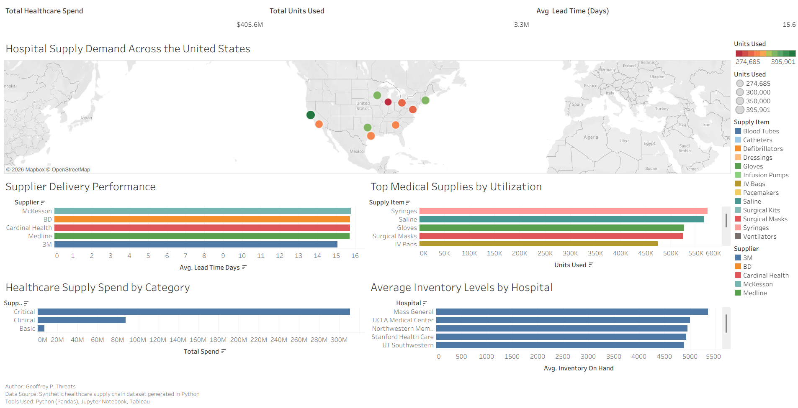
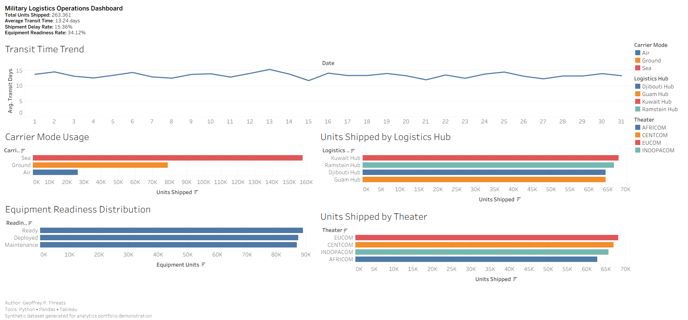
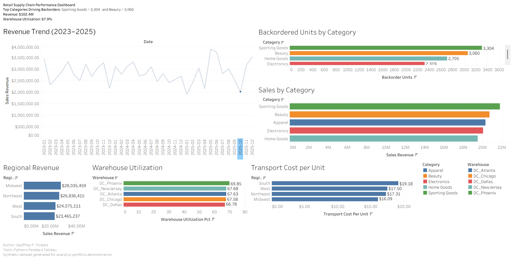

# Supply Chain Analytics Dashboard Portfolio



## Overview

This repository showcases a portfolio of business analytics dashboards built using **Python, Pandas, Jupyter Notebook, and Tableau**.

The project demonstrates how analytics and visualization can support operational decision-making across multiple supply chain environments.

Three industries are analyzed:

- Military logistics operations
- Retail supply chain performance
- Healthcare supply chain demand

Synthetic datasets were generated in Python to simulate realistic operational environments without exposing proprietary or sensitive business data.

---

## Tools & Technologies

- Python
- Pandas
- Jupyter Notebook
- Tableau

---

## Dashboards

### Military Logistics Operations Dashboard

This dashboard analyzes logistics activity across operational theaters and transportation modes.

**Key Analytics**
- Shipment transit time trends
- Carrier mode utilization
- Logistics hub shipment volume
- Equipment readiness distribution
- Units shipped by operational theater



---

### Retail Supply Chain Performance Dashboard

This dashboard analyzes operational performance in a retail distribution network.

**Key Analytics**
- Revenue trends across time
- Backorders by product category
- Warehouse utilization rates
- Regional revenue distribution
- Transportation cost per unit



---

### Healthcare Supply Chain Intelligence Dashboard

This dashboard analyzes healthcare supply demand and supplier performance across hospital locations in the United States.

**Key Analytics**
- Hospital supply demand across the United States
- Supplier delivery performance
- Top medical supplies by utilization
- Healthcare supply spend by category
- Average inventory levels by hospital


---

## Data Generation Notebook

The datasets used in this project were generated using Python and Pandas.

The notebook demonstrates the complete data engineering workflow used to create the datasets used by the dashboards.

- [Jupyter Notebook](notebooks/supply_chain_dataset_generation.ipynb)
- [HTML Report Version](notebooks/supply_chain_dataset_generation_report.html)

---

## Tableau Workbook

Download the full Tableau workbook here:

[Supply Chain Analytics Dashboards](dashboards/supply_chain_analytics_dashboards.twbx)

---

## Repository Structure

```text
supply-chain-analytics-dashboard-portfolio/
│
├── data/
├── dashboards/
├── images/
├── notebooks/
└── README.md
